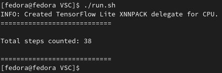

<div id="top"></div>

<!-- PROJECT LOGO -->
<br />
<div align="center">
  <a href="https://github.com/cyberslothmiko/VSC">
    
  </a>
  <p align="center">
    Utalizing OpenCV to visually count steps.
  </p>
</div>


<!-- TABLE OF CONTENTS -->
<details>
  <summary>Table of Contents</summary>
  <ol>
    <li>
      <a href="#about-the-project">About The Project</a>
      <ul>
        <li><a href="#built-with">Built With</a></li>
      </ul>
    </li>
    <li>
      <a href="#getting-started">Getting Started</a>
      <ul>
        <li><a href="#prerequisites">Prerequisites</a></li>
        <li><a href="#installation">Installation</a></li>
      </ul>
    </li>
    <li><a href="#usage">Usage</a></li>
    <li><a href="#license">License</a></li>
    <li><a href="#acknowledgments">Acknowledgments</a></li>
  </ol>
</details>


<!-- ABOUT THE PROJECT -->
## About The Project

I looked at my phone, saw the step counter and questioned its accuracy. Yep...thats it, thats how this project came to be. The goal of this project was to be able to visually track the steps of a person using computer vision to accuratly determine how many steps the person did.

The way the steps are counter is by watching the knee joints of the opencv frame and determining when they cross, this counting as "a step". This proved to be more reliable then loooking at the feet positions of the frame (although still not perfect as the frame sometimes resets randomly)

<div align="center"><h3>Example Video</h3></div>
<div align="center">


</div>
<div align="center"><h3>Example Output</h3></div>
<div align="center">
  
</div>

<p align="right">(<a href="#top">back to top</a>)</p>


## Built With

* [Python](https://www.python.org/)
* [OpenCV](https://opencv.org/)
* [Matplotlib](https://matplotlib.org/)
* [Bash](https://www.gnu.org/software/bash/)

<p align="right">(<a href="#top">back to top</a>)</p>


<!-- GETTING STARTED -->
## Getting Started

This program was tested and built inside a Fedora environment.
### Prerequisites
Python3
* RHEL / Fedora
  ```sh
  sudo yum install python3
  sudo dnf install python3
  ```
* Ubuntu
  ```sh
  sudo apt install python3
  ```

### Installation

1. Clone the repo
   ```bash
   git clone https://github.com/cyberslothmiko/OpenCV_VSC.git
   ```
2. Change into VSC directory
   ```bash
   cd VSC
   ```
3. Run the included python env setup script
   ```bash
   ./build.sh
   ```

<p align="right">(<a href="#top">back to top</a>)</p>


<!-- USAGE EXAMPLES -->
## Usage

After following the insillation instructions above, you can run the below command to view some examples

To exit the program gracefully, wait for the video to finish or press `q` on the "MediaPipe Pose" window. (If you only press q on the Graph window, the step count will be innacurate as the video will continue to play)

1. Walking example
   ```bash
   ./run.sh walking
   ```
2. Running example
   ```bash
   ./run.sh running
   ```

<p align="right">(<a href="#top">back to top</a>)</p>


<!-- LICENSE -->
## License

Distributed under the MIT License. See `LICENSE` for more information.

<p align="right">(<a href="#top">back to top</a>)</p>


<!-- ACKNOWLEDGMENTS -->
## Acknowledgments

Source of the example videos included
* [Walking Footage](https://www.youtube.com/watch?v=tBNqEwcvYjU)
* [Running Footage](https://www.youtube.com/watch?v=yzc-qsGEoB0)

<p align="right">(<a href="#top">back to top</a>)</p>
